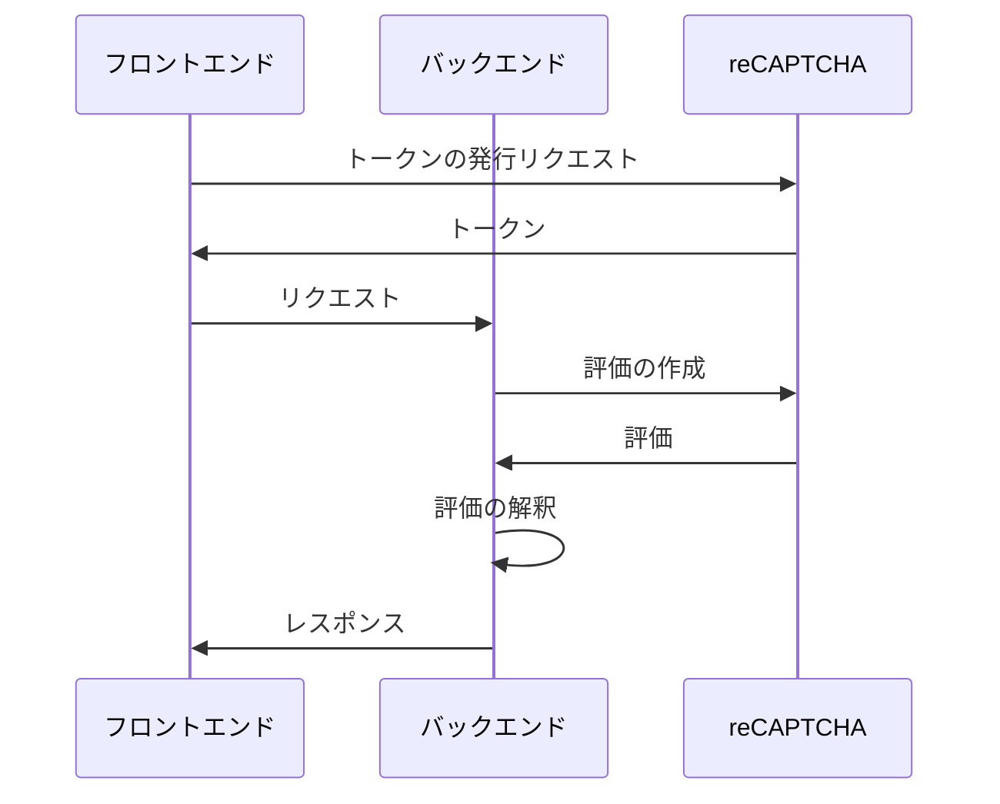

---
keywords:
  - reCAPTCHA Enterprise
---

# reCAPTCHA Enterprise をアプリケーションに導入する

[HERP Hire](https://lp.herp.cloud/) には利用企業の求人ページや応募フォームを作成できる機能があり，スパムによる応募を防ぐため [reCAPTCHA](https://www.google.com/recaptcha/about/) を導入している．[HERP](https://herp.co.jp/) では昨今，求人ページおよび応募フォームのリプレイスを進めているため，新たに開発されたコンポーネントにも reCAPTCHA を導入する必要性が生じた．それに際して，以前から利用していた [reCAPTCHA v3](https://developers.google.com/recaptcha/docs/v3) ではなく [reCAPTCHA Enterprise](https://cloud.google.com/recaptcha-enterprise) を導入することになった．

reCAPTCHA Enterprise の導入にあたっては非自明に感じられる箇所が多く，いくつか苦労した点があった．そのため，同様の実装を行う必要に迫られた開発者が同じ轍を踏まぬよう，大まかな手順を記しておくことにした．

前提として，今回の事例では，バックエンド (BFF) は Node.js により実行され，Amazon Web Services 上にデプロイされている．

---

## いくつかの選択

### バージョンの選択

reCAPTCHA を導入する際には，従来の製品である reCAPTCHA v3 を利用するか，あるいは後発の製品である reCAPTCHA Enterprise を利用するかを最初に選ぶ必要がある．

https://cloud.google.com/recaptcha-enterprise/docs/compare-versions

後者はその名の通り，企業における利用を想定して開発されており，基本的なサポートや [99.9% の SLA](https://cloud.google.com/recaptcha-enterprise/sla) が含まれている．また，Google Cloud Platform の一製品として提供されているため，公式に提供されているライブラリが利用できる，[Terraform](https://www.terraform.io/) の [Google Cloud Platform Provider](https://registry.terraform.io/providers/hashicorp/google/latest/docs) を通じた管理を実現できる[^1]，[Cloud Audit Logs](https://cloud.google.com/logging/docs/audit) による監査ログの保存・確認が行える，といった数々の利点がある．

以上を踏まえると，個人での開発でない限りは，素直に reCAPTCHA Enterprise を選択するのがよいだろう．

### セットアップ方法の選択

バックエンドのデプロイ先や，Google Cloud に対する認証方法によって，異なるセットアップ方法を選択することになる．

https://cloud.google.com/recaptcha-enterprise/docs/getting-started

バックエンドを Google Cloud にデプロイする場合は，Google Cloud の[サービス アカウント](https://cloud.google.com/iam/docs/understanding-service-accounts)がそのまま利用できるため，話は簡単である[^2]．他方，Google Cloud 以外にデプロイする場合はその限りではない．

以下では簡単のため，[API キーを利用したセットアップ方法](https://cloud.google.com/recaptcha-enterprise/docs/set-up-non-google-cloud-environments-api-keys)に沿って解説を進める[^3]．実際の導入時には，セキュリティリスクを軽減するため，[Workload Identity 連携](https://cloud.google.com/iam/docs/workload-identity-federation)を設定した上で，短い有効期限を持つトークンを都度発行する形にした方が望ましいだろう．

### キータイプの選択

[Google Cloud のプロジェクトを作成](https://cloud.google.com/resource-manager/docs/creating-managing-projects)したら，プロジェクト内に reCAPTCHA Enterprise の[**サイトキー** (_site key_)](https://cloud.google.com/recaptcha-enterprise/docs/keys) を発行する．サイトキーは英数字からなる40字の文字列であり，例として `6Lcm3XXXXXXXXXXXXXXXXXXXXXXXXXXXXXXX5mfX` といった形式を持つ．

サイトキーの発行に際して，**スコアベースのサイトキー** (_score-based site key_) と**チェックボックスのサイトキー** (_checkbox site key_) のいずれかを選択する必要がある．ユーザのインタラクションを必要としない前者が推奨されているため，特別な理由がない限りはそちらを選ぶことになるだろう．

詳細な比較は以下のドキュメントに記載されている．

https://cloud.google.com/recaptcha-enterprise/docs/choose-key-type

## アプリケーションに設定する値

アプリケーションは実行時に以下の値を知っている必要があるため，環境変数などを経由して参照できるようにしておく．以降，これらの値は，丸括弧内に示した変数によって参照できるものとする．

- バックエンド
  - 作成した Google Cloud のプロジェクト ID (`PROJECT_ID`)
  - サイトキー (`SITE_KEY`)
  - API キー (`API_KEY`)
- フロントエンド
  - サイトキー (`SITE_KEY`)

## 処理の流れ

アプリケーションが行う処理の流れを以下のシーケンス図に示す．



まずフロントエンドは，reCAPTCHA にリクエストを送信してトークンを取得する．バックエンドにリクエストを送る際にこのトークンを同時に送信する．次にバックエンドは，受け取ったトークンを reCAPTCHA に送信することで**評価** (_assessment_) を作成する．作成された評価を解釈することで，リクエストが正当なものであるか否かを判定する．

### トークンの発行

以下のヘルプページを参考に，必要な `<script>` 要素をフロントエンドに埋め込む．

https://cloud.google.com/recaptcha-enterprise/docs/instrument-web-pages#frontend_integration_score

すると，`window` オブジェクトに `grecaptcha` というプロパティが定義される．TypeScript を利用している場合は，[`@types/grecaptcha`](https://www.npmjs.com/package/@types/grecaptcha) パケッジを導入すれば型情報が利用可能になる．

`grecaptcha.enterprise.execute()` 関数を実行することでトークンが取得できる．この際に，ユーザが行った操作を表す[**アクション名** (_action name_)](https://cloud.google.com/recaptcha-enterprise/docs/actions) を指定する必要がある．ここでは例として，「応募フォームの送信」という意味合いで `SUBMIT_FORM` という値を指定している．

```typescript
await new Promise<void>((resolve) => {
  grecaptcha.enterprise.ready(() => {
    resolve();
  });
});

const token: string = await grecaptcha.enterprise.execute(SITE_KEY, {
  action: 'SUBMIT_FORM',
});

// TODO トークンを含んだリクエストの送信
```

発行したトークンは，この後バックエンドが評価を作成するために必要になるので，バックエンドへのリクエストに含めて送信する．

### 評価の作成

バックエンドは，受け取ったトークンを reCAPTCHA Enterprise の API エンドポイントに送信し，評価を作成する．

https://cloud.google.com/recaptcha-enterprise/docs/create-assessment

Google Cloud の API を利用するにあたっての認証には [`google-auth-library`](https://www.npmjs.com/package/google-auth-library) というライブラリを使うことになっている．Google Cloud は多様な認証方式をサポートしているため，適切なクライアントの初期化方法を選択する必要があるが，API キーを利用する場合は以下のように行うことができる．

```typescript
import { auth } from 'google-auth-library';

const authClient = auth.fromAPIKey(API_KEY);
```

reCAPTCHA Enterprise の API クライアントは，[`@google-cloud/recaptcha-enterprise`](https://www.npmjs.com/package/@google-cloud/recaptcha-enterprise) パケッジと，上記で作成した `authClient` を利用して以下のように作成する．

```typescript
import { v1 } from '@google-cloud/recaptcha-enterprise';

const client = new v1.RecaptchaEnterpriseServiceClient({ authClient });
```

API クライアントの [`.createAssessment()`](https://cloud.google.com/nodejs/docs/reference/recaptcha-enterprise/latest/recaptcha-enterprise/v1.recaptchaenterpriseserviceclient#_google_cloud_recaptcha_enterprise_v1_RecaptchaEnterpriseServiceClient_createAssessment_member_1_) メソッドを呼び出すことでリクエストを送信することができる．このメソッドの引数として渡すオブジェクトの型情報は，Google 社内で管理されている Protocol Buffers 3 のコードから生成されているようだが，驚くべきことに，レスポンスとして返却されるオブジェクトと同一の型が使われている．当然ながら，リクエストとレスポンスではそれぞれ異なるフィールドに値が入る．それにもかかわらず同じ型が流用されているため，型情報やそれを元にしたコード補完などを頼りにすることはできない．実際にどのプロパティを指定する必要があるかを知るためには，念入りにドキュメントを参照する必要がある．

```typescript
const projectPath = client.projectPath(PROJECT_ID);

const [response] = await client.createAssessment({
  assessment: {
    event: {
      siteKey: SITE_KEY,
      token, // フロントエンドから受け取ったトークン
    },
  },
  parent: projectPath,
});
```

reCAPTCHA からレスポンスを受け取ったら，まずは送信したトークン自体が正当なものであったかを確認する．そのためには `response.tokenProperties.valid` プロパティを参照すればよい．Protocol Buffers 3 ではメッセージ型のフィールドは基本的にすべてオプショナルであるため，TypeScript を利用している場合は，オブジェクトのすべてのプロパティについて値が `null` または `undefined` ではないことの検証を明示的に行う必要がある．

```typescript
if (response.tokenProperties === null || response.tokenProperties === undefined) {
  throw new Error('.tokenProperties is either null or undefined');
}

if (response.tokenProperties.valid === null || response.tokenProperties.valid === undefined) {
  throw new Error('.tokenProperties.valid is either null or undefined');
}

if (!response.tokenProperties.valid) {
  logger.error('Failed to create a reCAPTCHA assessment due to an invalid token', {
    name: response.name,
    reason: response.tokenProperties.invalidReason,
  });
}
```

### 評価の解釈

続いて，作成した評価を**解釈** (_interpret_) する．

https://cloud.google.com/recaptcha-enterprise/docs/interpret-assessment

まずは，フロントエンドでトークンを発行する際に指定されたアクションが，元々バックエンドで想定していたものと一致しているかを確認する．もし一致しなかった場合は，攻撃者が不正なリクエストを送信してきた蓋然性が高いと判断できる．

```typescript
const EXPECTED_ACTION = 'SUBMIT_FORM';

if (response.tokenProperties.action === null || response.tokenProperties.action === undefined) {
  throw new Error('.tokenProperties.action is either null or undefined');
}

if (response.tokenProperties.action !== EXPECTED_ACTION) {
  logger.info('Got mismatched action', {
    actual: response.tokenProperties.action,
    expected: EXPECTED_ACTION,
  });

  return false;
}
```

次に，評価の**スコア**を解釈する．評価には，0.0 から 1.0 までの範囲を持つスコアが付けられている．

> reCAPTCHA Enterprise には、0.0 から 1.0 までの範囲のスコアを持つ 11 のレベルがあります。スコア 1.0 は、インタラクションのリスクが低く、正当である可能性が非常に高いことを示します。一方で 0.0 は、インタラクションのリスクが高く、不正行為の可能性があることを示します。

あらかじめ閾値を定めておき，評価のスコアが閾値を上回った場合には処理を継続し，下回った場合には，疑わしいリクエストとみなして操作を拒否したり，追加での検証[^4]を行ったりといった実装をすることになるだろう．reCAPTCHA v3 の場合と異なり，reCAPTCHA Enterprise のドキュメントには，スコアの閾値としてどのような値を使うべきかは明示されていない．そのため，各開発者が各々の要件に合うように適切な閾値を設定する必要がある．

ところで，ドキュメントには，

> 11 のレベルのうち、デフォルトで使用できるスコアレベルは、0.1、0.3、0.7、0.9 の 4 つのみです。

との記載があり，スコアが 0.1 刻みで表されることが示唆されている．しかし，スコアは内部的には Protocol Buffers の32ビット浮動小数点数で表現されており[^5]，またそれを元にレスポンスボディの JSON が生成されていると推察されるため，実際には `0.9` ではなく `0.8999999761581421` という値が返却される．このため，閾値として 0.9 を指定してはいけない．

```typescript
const THRESHOLD = 0.85;

if (response.riskAnalysis === null || response.riskAnalysis === undefined) {
  throw new Error('.riskAnalysis is either null or undefined');
}

if (response.riskAnalysis.score === null || response.riskAnalysis.score === undefined) {
  throw new Error('.riskAnalysis.score is either null or undefined');
}

const { reasons, score } = response.riskAnalysis;

if (score < THRESHOLD) {
  logger.info('The assessment score is below the threshold', {
    reasons,
    score,
    threshold: THRESHOLD,
  });

  return false;
}

logger.info('The assessment score is above or equal to the threshold', {
  reasons,
  score,
  threshold: THRESHOLD,
});

return true;
```

## おわりに

本稿では reCAPTCHA Enterprise の導入手順を大まかに解説した．[評価へのアノテーション付け](https://cloud.google.com/recaptcha-enterprise/docs/annotate-assessment)など，解説を割愛した部分もあるため，より詳細な情報は公式のドキュメントを参照されたい．

導入に際しては Protocol Buffers に起因する問題に遭遇することが多く，かなり難のある開発者体験を強いられたが，この記事が先達となり，読者による実装の一助となれば幸いである．

## 採用情報

6年前に創業した HERP は本日をもって7期目を迎えた．HERP では，この記事に書かれているような内容もフロントエンドの一環と捉え，精力的にアプリケーション開発を行ってくれる Web フロントエンドエンジニアを募集している．

https://herp.careers/v1/herpinc/CrMCGkcKbpNA

## 脚注

[^1]: Terraform を用いた管理を行う場合，プロジェクト ([`google_project`](https://registry.terraform.io/providers/hashicorp/google/latest/docs/resources/google_project)) や，後述するサイトキー ([`google_recaptcha_enterprise_key`](google_recaptcha_enterprise_key)) といったリソースを作成することになる．
[^2]: 特に GKE を利用している場合は，[Workload Identity](https://cloud.google.com/kubernetes-engine/docs/concepts/workload-identity) を使用することで，Kubernetes の service account に対して簡単かつ安全に権限を付与することができるだろう．
[^3]: Terraform を用いた管理を行う場合，対応するリソースは [`google_apikeys_key`](https://registry.terraform.io/providers/hashicorp/google/latest/docs/resources/apikeys_key) である．
[^4]: ドキュメントでは例として，アカウントへのログインに際して二要素認証を求めるといった例が挙げられている．
[^5]: [実装](https://github.com/googleapis/google-cloud-node/blob/recaptcha-enterprise-v3.3.1/packages/google-cloud-recaptchaenterprise/protos/protos.json#L1392-L1398)
